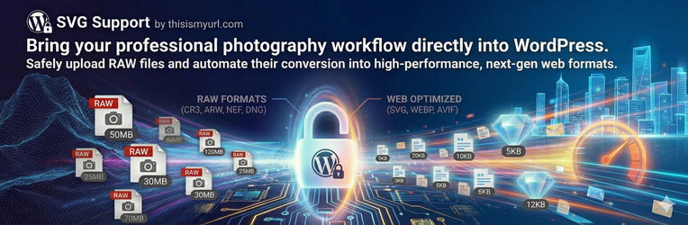

# SVG Support by thisismyurl.com

🔗 **[Register](https://thisismyurl.com/svg-support-thisismyurl/#register)**

**RAW Support by thisismyurl.com** is the definitive performance utility for photographers who want to bridge the gap between their camera and their website.

Traditionally, WordPress prevents the upload of RAW files because they are too large and complex for the web. This plugin removes those barriers, allowing you to manage your source photography within your Media Library while ensuring your site remains lightning-fast for visitors.

### Professional Workflow, Web Performance
Why waste time manually developing JPEGs for your site? With RAW Support, you can upload your high-fidelity files directly. If you use our **WebP Support** or **AVIF Support** plugins, this tool will automatically "develop" your RAW uploads into ultra-lightweight, next-gen formats upon entry.

### Key Benefits & Features:
* **Universal RAW Support:** Unlocks support for Canon (.cr2, .cr3), Nikon (.nef, .nrw), Sony (.arw), Adobe (.dng), Fujifilm (.raf), and more.
* **Automated Image Conversion:** Transform massive RAW data into web-ready WebP or AVIF formats instantly.
* **Preserve Site Speed:** Keep your high-quality visuals without the heavy file sizes that hurt SEO and user experience.
* **Smart Suite Integration:** Automatically detects sibling plugins to expand your handling and conversion options.
* **Intuitive Quality Control:** Use precision sliders in the Tools menu to balance perfect clarity with maximum compression.

## ⚙️ Installation
1. Upload the `raw-support-thisismyurl` folder to the `/wp-content/plugins/` directory.
2. Activate the plugin through the 'Plugins' menu in WordPress.
3. Navigate to **Tools > RAW Support** to choose your handling mode.

## ❓ FAQ
### Is this plugin free to use?
Yes! The RAW Support plugin is 100% free to download and use. We want to help photographers showcase their best work without technical limitations.
### Why should I register for support?
While the plugin is free, registering your copy provides you with priority technical assistance and automatic updates. This ensures your photography workflow stays compatible with the latest WordPress and camera format updates.
### How do I register?
Visit [https://thisismyurl.com/raw-support-thisismyurl/#register](https://thisismyurl.com/raw-support-thisismyurl/#register) to sign up. Once you have your key, enter it into the "License Key" field in the plugin settings to unlock professional support.
### Does this delete my original RAW files?
The plugin is designed to help you manage and convert your imagery. If you choose a conversion mode (like WebP), it creates a web-ready version for your site while allowing you to maintain your professional workflow.

## 🗺️ Roadmap & Activity

---
© 2026 [thisismyurl](https://thisismyurl.com)